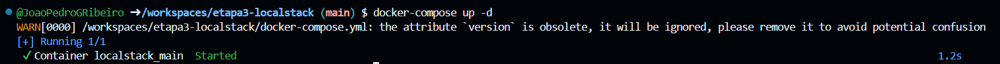
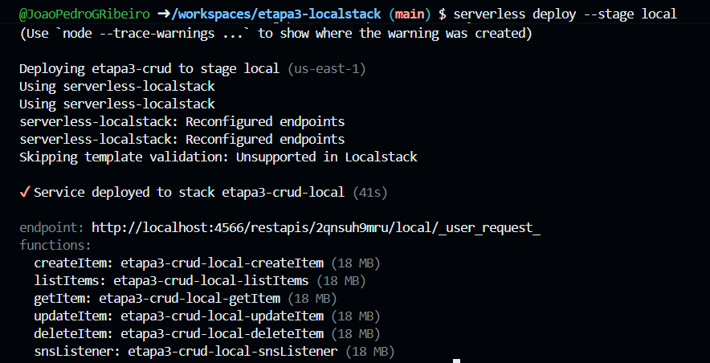
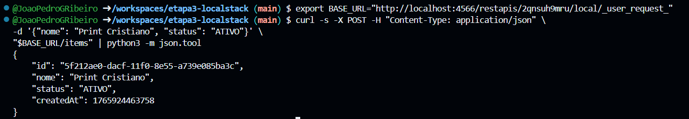
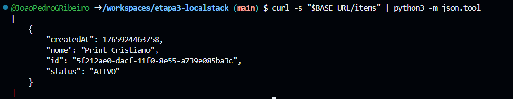
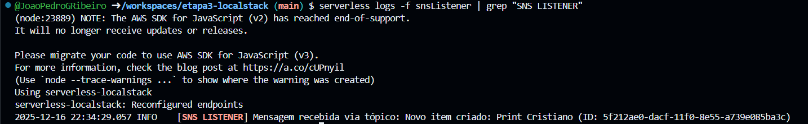
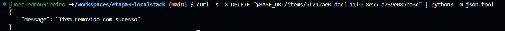

# Opção A: CRUD Serverless com Notificações SNS (LocalStack)

Este projeto implementa uma API REST Serverless rodando localmente, simulando AWS Lambda, DynamoDB e SNS, conforme os requisitos da Etapa 3.

## 📋 Pré-requisitos
- Node.js
- Docker & Docker Compose
- Serverless Framework v3

## 🚀 Instalação e Execução

### 1. Configurar o Ambiente
Instale as dependências do projeto e garanta que o plugin do LocalStack esteja configurado:
```bash
npm install
```

### 2. Iniciar o LocalStack
Suba o container do Docker que simula os serviços da AWS (DynamoDB e SNS):
```bash
docker-compose up -d
```


### 3. Fazer o Deploy
Faça a implantação da infraestrutura serverless no ambiente local:
```bash
serverless deploy --stage local
```


### 🧪 Instruções de Teste
Após o deploy, copie a URL base que apareceu no terminal (algo como http://localhost:4566/.../_user_request_) e execute os passos abaixo sequencialmente.

Passo 0: Configurar Variável (Facilitador)
Para não precisar colar a URL em todo comando, rode isso no terminal (substitua pela sua URL gerada):

```bash
export BASE_URL="SUA_URL_AQUI"
# Exemplo: export BASE_URL="http://localhost:4566/restapis/q7gmuuana0/local/_user_request_"
```

**Passo 1:** Criar Item (POST) - Dispara Notificação SNS
Cria um novo item no banco de dados. O sistema valida os dados e envia uma notificação automática.
```bash
curl -s -X POST -H "Content-Type: application/json" \
-d '{"nome": "Item de Teste", "status": "ATIVO"}' \
"$BASE_URL/items" | python3 -m json.tool
```


**Passo 2:** Listar Itens (GET)
Lista todos os itens cadastrados no DynamoDB.

```bash
curl -s "$BASE_URL/items" | python3 -m json.tool
Nota: Copie o id retornado neste passo para usar no teste de exclusão.
```


**Passo 3:** Verificar Logs do Subscriber (SNS)
Verifica se a função Lambda "ouvinte" recebeu a notificação do tópico SNS.
```bash
serverless logs -f snsListener | grep "SNS LISTENER"
```


**Passo 4:** Remover Item (DELETE)
Remove o item do banco de dados (substitua o ID abaixo).

```bash
# Exemplo de uso: .../items/b4f123-abc...
curl -s -X DELETE "$BASE_URL/items/COLE_SEU_ID_AQUI" | python3 -m json.tool
```


### 📦 Estrutura dos Arquivos
**serverless.yml:** Configuração da infraestrutura (DynamoDB, SNS, Funções).

**handler.js:** Lógica das funções Lambda (CRUD e Subscriber).

**docker-compose.yml:** Configuração do container LocalStack.
